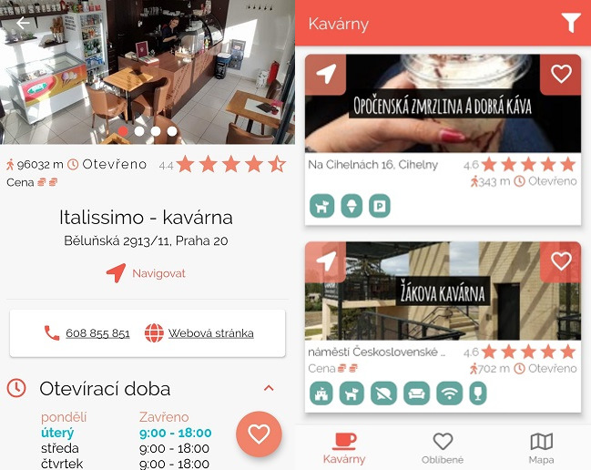

# Coffee Time :coffee:
Coffee Time is Flutter application as part of my master thesis in *Czech Technical University in Prague*. 

It allows users to easily search nearby cafes, display reviews and add custom tags which helps filtering cafes.

Available from [Google Play Store](https://play.google.com/store/apps/details?id=cz.petrnymsa.coffee_time). Give it a try :star:

## :computer: Used technologies 
- Flutter, of course. 
- Firebase and Cloud Functions as back-end
- Express.js for REST API

## :package: How to build and run

What you will need:

- Flutter SDK
- Firebase CLI
- Firebase account and created empty firebase project
- Google API Key

For details look at [firebase](firebase/README.md) and [mobile](mobile/README.md) directories.

## :star:  Can I contribute?
Yes. Just fork it and open pull request. Easy as that :+1:. 

## :interrobang: Found issue? 
Go ahead and open one. Thank you. 
